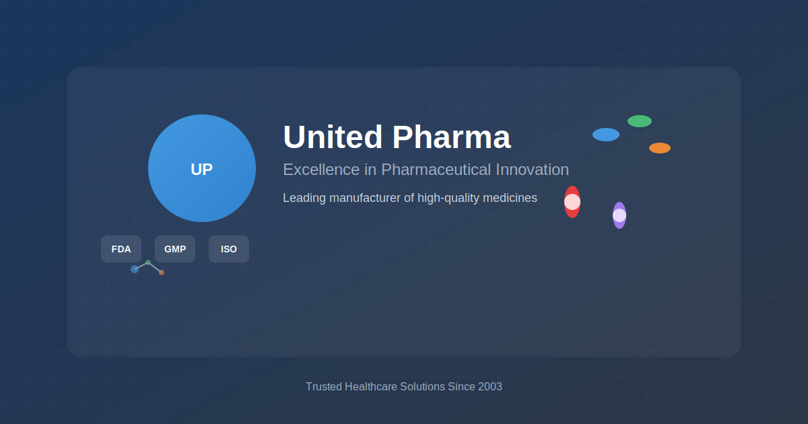

# United Pharma Company Site

A modern, professional pharmaceutical company website built with React and Vite, showcasing excellence in pharmaceutical innovation and manufacturing.



## 🏢 About United Pharma

United Pharma is a leading pharmaceutical manufacturer committed to delivering world-class healthcare solutions with uncompromising quality and regulatory compliance since 2003. Our website showcases our comprehensive range of pharmaceutical products, manufacturing capabilities, and commitment to healthcare excellence.

## ✨ Features

### 🎯 Core Functionality
- **Product Gallery**: Interactive RX product catalog with cart functionality
- **Toll Manufacturing**: Comprehensive manufacturing services showcase
- **Nutraceuticals**: Health supplement product lines
- **Custom Packaging**: Pharmaceutical packaging solutions
- **Quote System**: Professional quotation request system
- **Contact Management**: Multi-channel contact and inquiry system

### 🎨 Design & UX
- **Modern UI/UX**: Clean, professional pharmaceutical industry design
- **Responsive Design**: Optimized for all devices and screen sizes
- **Accessibility**: WCAG compliant with proper ARIA labels
- **Performance**: Optimized loading and smooth animations
- **SEO Optimized**: Comprehensive meta tags and social media integration

### 🛠 Technical Features
- **React 18**: Modern React with Hooks and Context API
- **Vite**: Lightning-fast development and build process
- **React Router**: Client-side routing with 404 handling
- **Error Boundaries**: Robust error handling and recovery
- **Local Assets**: Self-contained with custom SVG illustrations
- **Professional Build**: Production-ready with optimized bundles

## 🚀 Quick Start

### Prerequisites
- Node.js (version 16 or higher)
- npm or yarn package manager

### Installation

1. **Clone the repository**
   ```bash
   git clone https://github.com/ubaidsaif2244/united-pharma-company-site.git
   cd united-pharma-company-site
   ```

2. **Install dependencies**
   ```bash
   npm install
   ```

3. **Start development server**
   ```bash
   npm run dev
   ```

4. **Open in browser**
   Navigate to `http://localhost:5173`

## 📜 Available Scripts

| Command | Description |
|---------|-------------|
| `npm run dev` | Start development server with hot reload |
| `npm run build` | Build optimized production bundle |
| `npm run preview` | Preview production build locally |
| `npm run lint` | Run ESLint for code quality |

## 📁 Project Structure

```
src/
├── components/         # Reusable UI components
│   ├── Header.jsx     # Navigation header with glassmorphism
│   ├── AppFooter.jsx  # Professional footer with contact info
│   ├── CartSidebar.jsx # Shopping cart functionality
│   └── ...
├── pages/             # Main page components
│   ├── Home.jsx       # Landing page with hero section
│   ├── RXGallery.jsx  # Product catalog with filtering
│   ├── TollProducts.jsx # Manufacturing services
│   ├── NotFound.jsx   # 404 error page
│   └── ...
├── context/           # React Context providers
│   └── CartContext.jsx # Global cart state management
├── hooks/             # Custom React hooks
├── services/          # API integration services
├── styles/            # Global styles and design system
└── utils/             # Utility functions

public/
├── images/            # Custom SVG illustrations and assets
│   ├── hero-lab.svg   # Laboratory illustration
│   ├── og-image.svg   # Social media preview
│   └── products/      # Product category icons
└── favicon.ico        # Site favicon
```

## 🎨 Design System

### Color Palette
- **Primary**: Blue gradient (#667eea → #764ba2)
- **Secondary**: Gold accents (#ffd700)
- **Neutral**: Professional grays and whites
- **Status**: Green, orange, red for different states

### Typography
- **Headings**: Josefin Sans (brand elements)
- **Body**: Inter (readability optimized)
- **Responsive**: Fluid typography scaling

### Components
- **Glassmorphism**: Modern transparent header design
- **Cards**: Consistent card-based layouts
- **Animations**: Smooth hover effects and transitions
- **Icons**: Custom pharmaceutical-themed SVG icons

## 🏗 Architecture

### State Management
- **React Context**: Global cart and user state
- **Local State**: Component-specific state with hooks
- **Error Boundaries**: Graceful error handling

### Routing
- **React Router**: Client-side navigation
- **Lazy Loading**: Code splitting for performance
- **404 Handling**: Professional not-found page

### Performance
- **Vite**: Fast development and optimized builds
- **Tree Shaking**: Unused code elimination
- **Asset Optimization**: Compressed images and fonts
- **Lazy Loading**: Images and components

## 🔧 Configuration

### Environment Variables
Create a `.env.local` file for local development:
```env
VITE_API_BASE_URL=http://localhost:8000
VITE_CONTACT_EMAIL=info@unitedpharma.com
```

### Build Configuration
The project uses Vite with optimized settings for:
- Bundle splitting
- CSS minification
- Asset optimization
- Modern browser targets

## 🚀 Deployment

### Production Build
```bash
npm run build
```

### Deployment Platforms
- **Vercel**: Zero-config deployment
- **Netlify**: Continuous deployment from Git
- **GitHub Pages**: Static site hosting
- **Custom Server**: Standard static file serving

## 🤝 Contributing

We welcome contributions to improve the United Pharma website!

### Development Workflow
1. Fork the repository
2. Create a feature branch: `git checkout -b feature/amazing-feature`
3. Make your changes with proper commit messages
4. Test thoroughly across devices and browsers
5. Submit a pull request with detailed description

### Code Standards
- **ESLint**: Follow the configured linting rules
- **Prettier**: Consistent code formatting
- **Accessibility**: Maintain WCAG compliance
- **Performance**: Optimize for Core Web Vitals

## 📄 License

This project is licensed under the MIT License - see the [LICENSE](LICENSE) file for details.

## 📞 Contact

**United Pharma**
- Website: [https://unitedpharma.com](https://unitedpharma.com)
- Email: info@unitedpharma.com
- Phone: +92 1234567

**Developer**
- GitHub: [@ubaidsaif2244](https://github.com/ubaidsaif2244)
- Project Link: [https://github.com/ubaidsaif2244/united-pharma-company-site](https://github.com/ubaidsaif2244/united-pharma-company-site)

---

**Built with ❤️ for the pharmaceutical industry**
